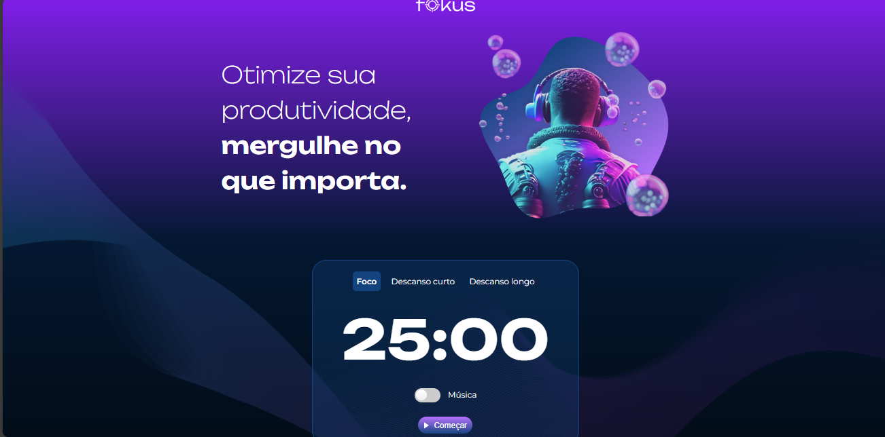

<!DOCTYPE html>
<html lang="pt-BR">
<head>
    <meta charset="UTF-8">
    <title>Projeto Fokus</title>
</head>
<body>
<h1>Projeto Fokus</h1>
<h2>Sobre o Projeto</h2>

O projeto <strong>Fokus</strong> é uma aplicação web interativa que permite ao usuário alternar entre diferentes modos de foco e produtividade utilizando a técnica Pomodoro. Com Fokus, você pode otimizar sua produtividade ao mergulhar no que realmente importa.

<h2>Tecnologias Utilizadas</h2>
<ul>
    <li><strong>HTML</strong></li>
    <li><strong>CSS</strong></li>
    <li><strong>JavaScript</strong></li>
</ul>
<h2>Funcionalidades</h2>
<ul>
    <li>Temporizador interativo com modos de foco, descanso curto e descanso longo.</li>
    <li>Possibilidade de alterar o conteúdo de textos na tela.</li>
    <li>Modificação de atributos de elementos HTML, como o <code>src</code> de imagens.</li>
    <li>Adição e remoção de classes CSS para alterar o estilo dos elementos.</li>
    <li>Seleção de elementos específicos da página para manipulação.</li>
    <li>Adição de event listeners para capturar interações do usuário, como cliques em botões.</li>
</ul>
<h2>Aprendizados</h2>

Durante o desenvolvimento deste projeto, pude aprender e aplicar os seguintes conceitos:

<ul>
    <li>Alteração do conteúdo de textos com o método <code>innerHTML</code>.</li>
    <li>Modificação de atributos de elementos HTML com o método <code>setAttribute</code>.</li>
    <li>Manipulação de classes CSS com o método <code>classList</code>.</li>
    <li>Seleção de elementos específicos com o método <code>querySelector</code>.</li>
    <li>Implementação de event listeners para capturar interações do usuário.</li>
</ul>
<h2>Como Usar</h2>
<ol>
    <li>Abra o arquivo <code>index.html</code> em seu navegador de preferência.</li>
    <li>Utilize o temporizador Pomodoro para iniciar sessões de trabalho e pausas.</li>
    <li>Interaja com a página clicando nos botões para ver os elementos sendo alterados dinamicamente.</li>
</ol>
<h2>Tecnologias</h2>

  
  
  

<h2>Contato</h2>

Aldemir Junior - <a href="https://www.linkedin.com/in/aldemir-desenvolvedor/">LinkedIn</a> - <a href="mailto:aldemirjuniorg@gmail.com">aldemirjuniorg@gmail.com</a>

</body>
</html>
